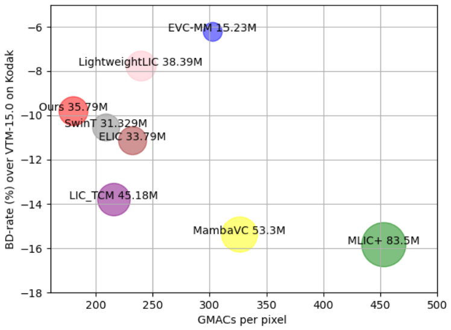

# SSMIC: Efficient Image Compression Using Advanced State Space Models

Welcome to the official PyTorch repository for the paper "[Efficient Image Compression Using Advanced State Space Models](https://arxiv.org/pdf/2409.02743)".

For any questions, please contact [zigbou111@gmail.com](mailto:zigbou111@gmail.com).

## Abstract

Transformers have led to learning-based image compression methods that outperform traditional approaches. However, these methods often suffer from high complexity, limiting their practical application. To address this, various strategies such as knowledge distillation and lightweight architectures have been explored, aiming to enhance efficiency without significantly sacrificing performance. This paper proposes a State Space Model based Image Compression (SSMIC) architecture. This novel architecture balances performance and computational efficiency, making it suitable for real-world applications. Experimental evaluations confirm the effectiveness of our model in achieving a superior BD-rate while significantly reducing computational complexity and latency compared to competitive learning-based image compression methods.

## Architectures


## Evaluation Results

<p align="center">
    
    
</p>

## Installation

This codebase was tested with the following environment configurations. The requirements file for installation is available.

- gcc 11
- Python 3.11
- CUDA 12.1 during installation and CUDA 11.6 while executing training and testing.

To set up the environment, follow these steps:

1. Create a virtual environment:
    ```sh
    python3.11 -m venv env
    ```

2. Activate the virtual environment:
    ```sh
    source env/bin/activate
    ```

3. Install the required packages:
    ```sh
    pip install -r requirements.txt
    cd selective_scan/csrc
    pip install *
    ```

## Dataset

The dataset directory is expected to be organized as below:

<details>
<summary>dataset_root/</summary>
<ul>
    <li>train/</li>
    <ul>
        <li>train_1.jpg</li>
        <li>train_2.jpg</li>
        <li>...</li>
    </ul>
    <li>test/</li>
    <ul>
        <li>test_1.jpg</li>
        <li>test_2.jpg</li>
        <li>...</li>
    </ul>
</ul>
</details>

## Training

```sh
export FORCE_CUDA="0" CUDA_VISIBLE_DEVICES=0 python train.py -a SSMIC -d <dataset_root> \
    --batch-size 8 -lr 1e-4 --save --cuda --lambda 500 --epochs <num_epoch>
```

## Testing

```sh
export FORCE_CUDA="0" CUDA_VISIBLE_DEVICES=0 python eval.py checkpoint -a SSMIC <dataset_root> \
    -p <pretrained_ckpt_path> -d <dataset_root> --cuda
```

## Notes

We use [calflops](https://github.com/MrYxJ/calculate-flops.pytorch) to calculate MACs, FLOPs, and model parameters.

## Citation

```bibtex
@INPROCEEDINGS{10743882,
  author={Arezki, Bouzid and Mokraoui, Anissa and Feng, Fangchen},
  booktitle={2024 IEEE 26th International Workshop on Multimedia Signal Processing (MMSP)}, 
  title={Efficient Image Compression Using Advanced State Space Models}, 
  year={2024},
  volume={},
  number={},
  pages={1-6},
  keywords={Visualization;Image coding;Computational modeling;Memory management;Transformers;Data models;Real-time systems;Computational complexity;Optimization;Context modeling;Image Compression;State Space Models;Computational Complexity;Rate-Distortion},
  doi={10.1109/MMSP61759.2024.10743882}
}
```

## Acknowledgement

Our code is based on the implementation of [CompressAI](https://github.com/InterDigitalInc/CompressAI), [Mamba](https://github.com/state-spaces/mamba), [Vmamba](https://github.com/MzeroMiko/VMamba), and [TBTC](https://github.com/ali-zafari/TBTC). We thank the authors for open-sourcing their code.
